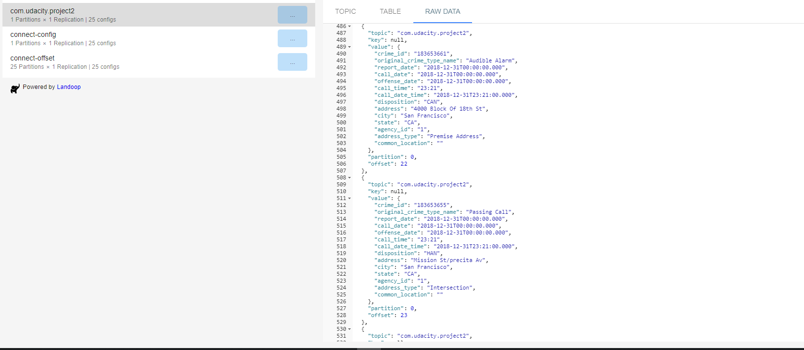
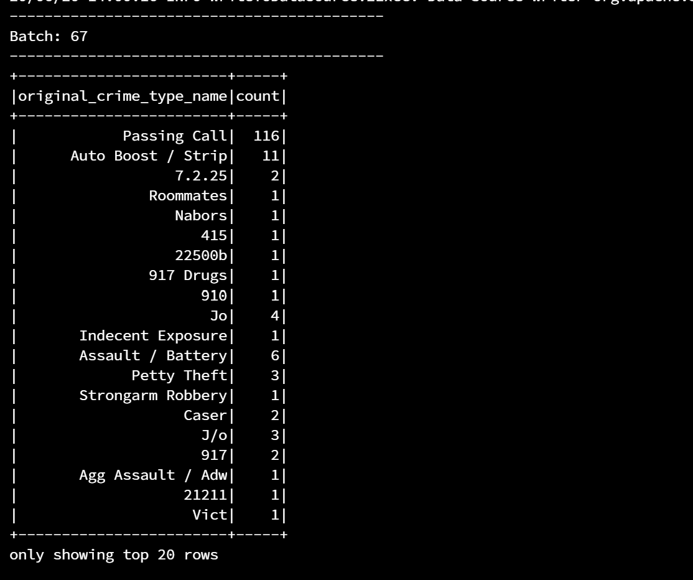
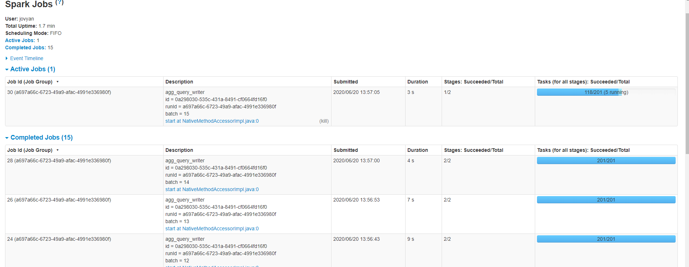

# SF Crime Project

## Prerequisites

* docker
* docker-compose
* unzip

## Setup

```sh
docker-compose up -d
docker-compose exec jupyter pip install -r requirements.txt 
unzip data.zip
```


## Step 1

> Complete the code for the server in producer_server.py and kafka_server.py.

See [producer_server.py](./producer_server.py) and see [kafka_server.py](kafka_server.py) 

For run the kafka producer, do:

```sh
docker-compose exec jupyter python kafka_server.py
```

> To see if you correctly implemented the server, use the command

```sh
docker-compose exec kafka0  kafka-console-consumer --bootstrap-server localhost:9092 --topic com.udacity.project2 --from-beginning
```

Console screenshot 

Topic UI screenshot (http://localhost:8085/) 

## Step 2

> Apache Spark already has an integration with Kafka brokers, so we would not normally need a separate Kafka consumer. However, we are going to ask you to create one anyway. Why? We'd like you to create the consumer to demonstrate your understanding of creating a complete Kafka Module (producer and consumer) from scratch. In production, you might have to create a dummy producer or consumer to just test out your theory and this will be great practice for that.

See [consumer_server.py](consumer_server.py)

For run the kafka consumer, do:

```sh
docker-compose exec jupyter python consumer_server.py
```

Console screenshot 

> Implement all the TODO items in data_stream.py. You may need to explore the dataset beforehand using a Jupyter Notebook.

See [data_stream.py](./data_stream.py)

> Do a spark-submit using this command: 

```sh
docker-compose exec jupyter spark-submit --packages org.apache.spark:spark-sql-kafka-0-10_2.11:2.4.5 data_stream.py
```

> Take a screenshot of your progress reporter after executing a Spark job. You will need to include this screenshot as part of your project submission.



> Take a screenshot of the Spark Streaming UI as the streaming continues. You will need to include this screenshot as part of your project submission.



## Step 3

> How did changing values on the SparkSession property parameters affect the throughput and latency of the data?

By referring to the `processedRowsPerSecond`. We can increase the throughput and latency with a higher value or decrease it with a lower value.


> What were the 2-3 most efficient SparkSession property key/value pairs? Through testing multiple variations on values, how can you tell these were the most optimal?

These two properties seem to be the most efficient for increase the throughput and latency.

- `spark.default.parallelism`: Total number of cores on all executor nodes. It depends on the total number of all cores on all machines. The rule of thumb is to set 3 per CPU core.

- `spark.streaming.backpressure.enabled`: feature called backpressure that eliminate the need to set a rate limit, as Spark Streaming automatically figures out the rate limits and dynamically adjusts them if the processing conditions change.
